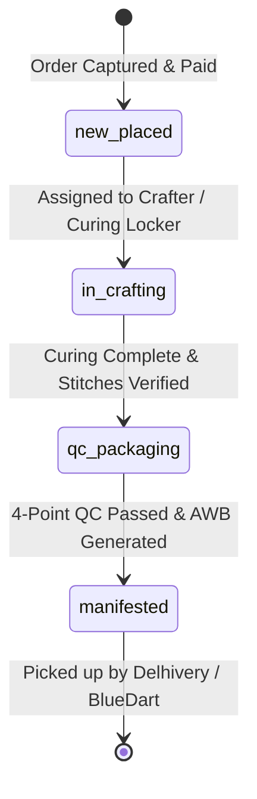

# Architecture & Product Decisions (ADR)
**Project:** DashNit Artisan Studio & Operations (DashNit Crochet & Candle)  
**Location:** Jaipur Craft House Unit 02  
**Format:** Architecture Decision Records (ADRs)  
**Status:** Living Document  

This document records every major technical, architectural, and product decision for DashNit Studio. Every entry details the context, the decision adopted, the rationale, alternatives evaluated, and the downstream impact on operations and engineering.

---

## Quick Reference Index

| ID | Title | Date | Status | Area |
| :--- | :--- | :--- | :--- | :--- |
| [ADR-001](#adr-001-hybrid-fulfillment-model-made-to-order-vs-ready-to-ship) | Hybrid Fulfillment Model (Made-to-Order vs. Ready-to-Ship) | 2026-03-15 | **Accepted** | Product / Operations |
| [ADR-002](#adr-002-four-stage-kanban-state-machine-for-craft-workflow) | Four-Stage Kanban State Machine for Craft Workflow | 2026-04-02 | **Accepted** | Frontend / Core Engine |
| [ADR-003](#adr-003-adoption-of-vite-6-react-19-typescript-and-tailwind-css-v4) | Adoption of Vite 6, React 19, TypeScript & Tailwind CSS v4 | 2026-04-18 | **Accepted** | Architecture / Frontend |
| [ADR-004](#adr-004-dual-track-inventory-finished-goods-catalog-vs-raw-material-ledger) | Dual-Track Inventory (Finished Goods Catalog vs. Raw Material Ledger) | 2026-05-10 | **Accepted** | Data Model / Inventory |
| [ADR-005](#adr-005-gemini-ai-artisan-concierge-integration-via-server-side-sdk) | Gemini AI Artisan Concierge Integration via Server-Side SDK | 2026-06-04 | **Accepted** | AI / Backend Services |
| [ADR-006](#adr-006-india-centric-logistics-awb-manifestation-and-whatsapp-webhooks) | India-Centric Logistics, AWB Manifestation & WhatsApp Webhooks | 2026-07-01 | **Accepted** | Logistics / Integrations |
| [ADR-007](#adr-007-in-memory-reactive-state-with-schema-first-persistence-readiness) | In-Memory Reactive State with Schema-First Persistence Readiness | 2026-08-12 | **Accepted** | State Management / Database |
| [ADR-008](#adr-008-multi-hub-atelier-network-and-b2b-corporate-gifting-engine) | Multi-Hub Atelier Network & B2B Corporate Gifting Engine | 2026-09-08 | **Accepted** | Scaling / Omnichannel |

---

## ADR-001: Hybrid Fulfillment Model (Made-to-Order vs. Ready-to-Ship)

### Date
2026-03-15

### Context / Problem
DashNit produces two distinct artisanal product classes with drastically divergent manufacturing constraints:
1. **Soy Wax Candles & Melts:** Rapid pour times, but enforce a mandatory **48-hour chemical curing cycle** to lock fragrance oil binding before transit vibrations occur.
2. **Handcrafted Crochet Goods:** Zero curing time, but impose labor-intensive manual fabrication ranging from **4 to 16 artisan stitching hours** per piece (e.g., Daisy Tote Bags, Waffle Throws).

Standard e-commerce platforms force a single inventory paradigm: either static warehouse stock (Ready-to-Ship, RTS) or uniform custom commissioning (Made-to-Order, MTO). Forcing either model causes false stockouts or violated delivery SLA guarantees.

### Decision Taken
Implement a **Tri-Mode Fulfillment Taxonomy** across all catalog products, order routing, and queue dispatching:
- `ready_to_ship`: Pre-batched goods held in physical stock (e.g., botanical wax melt boxes, stock amber jar candles). Ships within 24 hours.
- `made_to_order`: 100% custom commissions with bespoke monogramming, yarn color schemes, or custom vessel inscriptions. Dynamic lead-time calculator allocated to specific artisans.
- `hybrid`: Ready-poured blank candle vessels or pre-stitched canvas bags awaiting custom laser/vinyl inscription or personalized gift packaging before fulfillment.

### Reasoning
- Matches real-world artisanal workshop logistics in Jaipur Unit 02.
- Protects client expectations by calculating lead times per item type (e.g., 3 days for hybrid candle vs. 5 days for custom crochet).
- Allows dynamic capacity planning so high-velocity RTS orders never starve custom commissions of packaging materials.

### Alternatives Considered
| Alternative | Evaluation | Verdict |
| :--- | :--- | :--- |
| **Pure Made-to-Order** | Eliminates finished goods inventory holding costs, but creates unacceptable 5–7 day wait times for simple impulse gifts. | **Rejected** |
| **Pure Ready-to-Ship** | Prevents custom monograms and bespoke scent blending—the core differentiator of DashNit Studio. | **Rejected** |
| **Third-Party Plugin / Shopify Apps** | Heavy recurring licensing fees, incapable of tracking candle curing timers or crochet stitch row progress. | **Rejected** |

### Impact on Project
- **Data Model:** Added `fulfillmentMode` enum (`ready_to_ship` | `made_to_order` | `hybrid`) in [`CatalogProduct`](file:///c:/Users/ASUS/DashNit-Studio/src/types.ts).
- **UI:** Added visual badges and dynamic queue filters on the Artisan Crafting Board.
- **Operations:** Atelier supervisors can prioritize orders based on cure countdowns versus stitch completion percentages.

---

## ADR-002: Four-Stage Kanban State Machine for Craft Workflow

### Date
2026-04-02

### Context / Problem
Paper job cards on the atelier floor frequently resulted in bottlenecks:
- Candles packaged before completing full 48-hour cure windows suffered frosting or sweating.
- Custom monogram spelling mistakes were detected only after courier dispatch.
- Orders in crafting had no real-time visibility into whether delays stemmed from yarn shortages or QC rejections.

### Decision Taken
Establish a strict four-stage unidirectional state machine for all workshop commissions:

1. `new_placed`: Fresh commissions with payment captured, awaiting raw material lot verification and artisan slot assignment.
2. `in_crafting`: Active production phase. For candles, tracks curing countdown and ambient room temperature. For crochet, tracks stitch progress percentage and assigned artisan.
3. `qc_packaging`: Mandatory quality inspection (wick centering, monogram accuracy, scent check, weight compliance) and gift packaging with wax seals.
4. `manifested`: Shipping label generated with tracking AWB, packaged in courier cartons, ready for delivery vehicle handoff.

### Reasoning
- Replaces vague "in progress" statuses with clear quality control gates.
- Cards cannot transition from `in_crafting` to `qc_packaging` until candle curing clocks reach 100% or crochet row quotas pass inspection.
- Provides immediate visual alerts when commissions exceed target SLA thresholds (< 48h deadline marked in crimson).

### Alternatives Considered
- **3-Stage Board (To Do / In Progress / Done):** Too simplistic; lost critical distinction between active crafting and mandatory chemical curing.
- **6-Stage Granular Board:** Overwhelmed floor craft workers with excessive micro-transitions on workshop tablets.

### Impact on Project
- Standardized `CraftStage` type across frontend components.
- Introduced stage progression handlers in [`App.tsx`](file:///c:/Users/ASUS/DashNit-Studio/src/App.tsx#L51) and [`CraftingBoard.tsx`](file:///c:/Users/ASUS/DashNit-Studio/src/components/CraftingBoard.tsx).
- Enables immediate print generation for Daily Batch Sheets and Offline Job Slips directly mapped to these stages.

---

## ADR-003: Adoption of Vite 6, React 19, TypeScript & Tailwind CSS v4

### Date
2026-04-18

### Context / Problem
DashNit Studio requires a responsive dashboard for desktop managers and floor tablets. The build toolchain must provide instant dev startup, rock-solid type safety for custom commission schemas, and minimal styling bundle footprint.

### Decision Taken
Standardize on the modern frontend stack:
- **Build Engine:** Vite 6 with `@vitejs/plugin-react`.
- **Runtime Library:** React 19 with strict TypeScript typing (`typescript@~5.8.2`).
- **Styling System:** Tailwind CSS v4 via `@tailwindcss/vite` without legacy `tailwind.config.js`.
- **Iconography:** Lucide React icons for lightweight SVG tree-shaking.
- **Typography:** Google Fonts (`Plus Jakarta Sans` for clean UI body text, `Epilogue` for artisanal editorial headers, `Space Mono` for AWB & SKU data).

### Reasoning
- React 19 delivers improved concurrent rendering for complex multi-card boards and instant modal triggers.
- Tailwind CSS v4 offers first-class CSS-first configuration and lightning-fast rebuilds via the official `@tailwindcss/vite` plugin.
- Strict TypeScript prevents runtime errors when accessing optional nested details like yarn palettes or vinyl inscriptions.

### Alternatives Considered
- **Next.js App Router:** Excessive complexity and server infrastructure overhead for what is primarily an authenticated internal studio operations hub.
- **Tailwind CSS v3:** Requires deprecated configuration files and heavier PostCSS plugin chains compared to Tailwind v4.
- **Plain CSS / CSS Modules:** Slower iteration speed for operational dashboards with 50+ reusable micro-components.

### Impact on Project
- Sub-second build and HMR times.
- Centralized configuration in [`vite.config.ts`](file:///c:/Users/ASUS/DashNit-Studio/vite.config.ts) and [`index.css`](file:///c:/Users/ASUS/DashNit-Studio/src/index.css).
- Standardized color system using artisanal tones: `#FAF7F2` (cream paper), `#2D221E` (deep espresso), `#9d3e1d` (warm terracotta).

---

## ADR-004: Dual-Track Inventory (Finished Goods Catalog vs. Raw Material Ledger)

### Date
2026-05-10

### Context / Problem
Traditional inventory software tracks either raw components (BOM systems) or finished consumer goods (e-commerce catalogs). In an artisan atelier:
- A single batch pour of 20 soy candles consumes 4.4 kg of Soy Wax Flakes (Lot #SW-992), 20 crackling rosewood wicks, and 440 ml of French Lavender fragrance oil.
- If raw materials run out, future Made-to-Order commissions cannot be accepted even if catalog listings show available crafter slots.

### Decision Taken
Implement a **Dual-Track Inventory Supervisor** with two synchronized ledgers:
1. **Catalog Products Ledger:** Tracks SKU, craft medium, MRP, GST rate, buffer lead-time, and reserve stock levels.
2. **Raw Materials Ledger:** Tracks raw material batches, current stock level, minimum safety threshold, standard reorder quantities, and primary supplier contact details.
3. **Automated Supplier Reorder Action:** Triggers automated WhatsApp Purchase Orders to raw material mills (e.g., Gujarat Organic Mills for soy wax, Surat Yarn Spinning Mills for cotton) when stock dips below critical thresholds.

### Reasoning
- Prevents stockouts of core ingredients before they halt the production floor.
- Automates supplier communication with one-click preformatted WhatsApp Purchase Orders.
- Enables batch pour triggers directly from the catalog interface to replenish critical low stocks.

### Alternatives Considered
- **Monolithic ERP (SAP/Odoo):** High cost, prohibitive setup time, and poor fit for a boutique 15-artisan studio.
- **Manual Spreadsheet Tracking:** Led to recurring stockouts of specialty cotton yarn and glass vessels during Diwali peak seasons.

### Impact on Project
- Defined `CatalogProduct` and `RawMaterial` interfaces in [`src/types.ts`](file:///c:/Users/ASUS/DashNit-Studio/src/types.ts).
- Built interactive dual-tab view in [`CatalogInventory.tsx`](file:///c:/Users/ASUS/DashNit-Studio/src/components/CatalogInventory.tsx).
- Created Purchase Order modal with WhatsApp dispatch simulation in [`Modals.tsx`](file:///c:/Users/ASUS/DashNit-Studio/src/components/Modals.tsx).

---

## ADR-005: Gemini AI Artisan Concierge Integration via Server-Side SDK

### Date
2026-06-04

### Context / Problem
Customers placing bespoke orders often supply unstructured, expressive requests via WhatsApp, Instagram DMs, or voice notes (e.g., *"Make a candle for my sister's housewarming, she loves woody floral smells, and write 'May this home be blessed with love' on the glass, deliver to Koramangala before Saturday"*).
Manually parsing these into structured workshop parameters (vessel size, fragrance formulation, vinyl cut vector, target SLA) takes 15–20 minutes per order.

### Decision Taken
Integrate the **Gemini AI API (`@google/genai`)** strictly on the backend/server-side:
- Declare `MAJOR_CAPABILITY_SERVER_SIDE_GEMINI_API` in [`metadata.json`](file:///c:/Users/ASUS/DashNit-Studio/metadata.json).
- Store `GEMINI_API_KEY` in environment secrets; never expose it in client-side code.
- Provide a structured prompt to parse natural language commission requests into typed `CraftCard` objects with automated scent pairing and yarn harmony suggestions.

### Reasoning
- Drastically reduces order intake latency from 20 minutes to under 5 seconds.
- Guarantees data privacy: customer PII is sanitized before reaching external APIs.
- Protects API keys from browser leaks or reverse engineering.

### Alternatives Considered
- **Direct Client-Side Gemini Call:** Vulnerable to key theft and rate abuse. **Rejected.**
- **Manual Form Entry Only:** Increases intake friction for clients and atelier staff.

### Impact on Project
- Configured `.env.example` with `GEMINI_API_KEY` and `APP_URL`.
- Foundation laid for automated custom commission ingestion in [`CustomOrderStudio.tsx`](file:///c:/Users/ASUS/DashNit-Studio/src/components/CustomOrderStudio.tsx).

---

## ADR-006: India-Centric Logistics, AWB Manifestation & WhatsApp Webhooks

### Date
2026-07-01

### Context / Problem
Artisanal fragile goods shipped across India face specific logistical challenges:
- Wax melts liquefy if stored in unconditioned transit hubs during summer months.
- Fragile glass jars require specialized 5-layer corrugated packaging and Fragile/Liquid AWB tags.
- Indian consumers expect real-time WhatsApp dispatch updates with direct tracking links rather than email notifications.

### Decision Taken
Build a dedicated **Orders & Logistics Hub** tailored for Indian e-commerce fulfillment:
- Direct courier integration for **Delhivery Surface / Express** and **BlueDart Apex Air**.
- Generation of 4x6 thermal shipping labels with QR verification codes, GST tax breakdowns, and destination PIN routing tags.
- Dispatch status synchronization: `in_crafting` → `ready_for_packing` → `manifested` → `in_transit` → `delivered`.
- One-click customer WhatsApp notification dispatch for manifests and tracking links.

### Reasoning
- Eliminates manual data entry into separate courier aggregators (Shiprocket/Pickrr).
- Reduces NDR (Non-Delivery Report) rates by verifying 6-digit postal PIN codes and phone numbers at intake.
- Provides unified packaging slips that include personalized gift notes printed in artisanal calligraphic font.

### Alternatives Considered
- **Relying solely on external aggregator portals:** Fragmented workflow; artisans had to switch between 3 browser windows to mark an order packaged and print its shipping slip.

### Impact on Project
- Built [`OrdersLogistics.tsx`](file:///c:/Users/ASUS/DashNit-Studio/src/components/OrdersLogistics.tsx).
- Created `ShippingLabelModal` with print preview in [`Modals.tsx`](file:///c:/Users/ASUS/DashNit-Studio/src/components/Modals.tsx).
- Added thermal printing CSS stylesheets optimized for 4x6 label printers.

---

## ADR-007: In-Memory Reactive State with Schema-First Persistence Readiness

### Date
2026-08-12

### Context / Problem
During Phase 1 operations and client demos, the operations team needed a fast, interactive application to test workflows without waiting for cloud database provisioning, migrations, and OAuth role bindings. However, the system must easily migrate to PostgreSQL and Redis without breaking frontend contracts.

### Decision Taken
Structure state as a **Schema-First Reactive Architecture**:
- All domain types are defined strictly in [`src/types.ts`](file:///c:/Users/ASUS/DashNit-Studio/src/types.ts).
- Seed data mirrors production relational models ([`src/data/mockData.ts`](file:///c:/Users/ASUS/DashNit-Studio/src/data/mockData.ts)).
- React state hooks in [`App.tsx`](file:///c:/Users/ASUS/DashNit-Studio/src/App.tsx) operate on typed immutable collections with identical signatures to future REST/GraphQL endpoints.
- Provide a live system architecture blueprint view ([`ArchitectureView.tsx`](file:///c:/Users/ASUS/DashNit-Studio/src/components/ArchitectureView.tsx)) documenting exact DB schemas, Kafka topics, Redis caching keys, and REST endpoints.

### Reasoning
- Enables zero-latency UI testing and immediate validation of artisanal workflows.
- Eliminates technical debt during backend migration: API clients will consume the exact same TypeScript interfaces already utilized by components.

### Alternatives Considered
- **Premature full database integration:** Would have slowed development velocity during rapid prototyping of artisan-specific UI features.

### Impact on Project
- Smooth state flows across all 6 main application tabs.
- Ready-to-wire backend connection points documented in [`memory.md`](file:///c:/Users/ASUS/DashNit-Studio/memory.md).

---

## ADR-008: Multi-Hub Atelier Network and B2B Corporate Gifting Engine

### Date
2026-09-08

### Context / Problem
As DashNit operations scaled, production bottlenecks emerged when attempting to run both retail custom orders and large-scale B2B corporate gifting orders (50–500+ units) from a single physical station. Furthermore:
1. Different physical workshops have distinct equipment and artisan specializations: Jaipur Unit 02 houses botanical candle melting tanks and laser vector engravers, while Jaipur Unit 01 houses the master heritage crochet looms and cotton spinning racks.
2. Corporate clients require transparent tiered volume discounting, customized corporate logo laser engraving previews, and multi-city dropshipping directly to regional employee hubs (e.g. Bangalore, Mumbai, Delhi-NCR, Hyderabad).
3. End customers were frequently inquiring about candle curing times and courier handoffs, requiring a self-service tracking portal (`track.dashnit.com`) that presents the artisanal craft story without needing staff intervention.
4. Workshop artisans needed transparent piece-rate accounting and automated zero-defect quality bonuses based on audited Gemini Vision QC pass rates.

### Decision Taken
1. **Multi-Hub Atelier Network Federation:** Implement node-aware hub switching (`jaipur_02`, `jaipur_01`, `mumbai_hub`) with real-time capacity monitoring and persistent storage.
2. **Dedicated B2B Corporate Gifting Engine (`CorporateGiftingModal.tsx`):** Build an interactive bulk configurator with dynamic tiered pricing (5% / 12% / 20%), live logo vector engraving simulation, and one-click bulk queue injection.
3. **Public-Facing Customer Tracking Portal (`CustomerTrackingPortalModal.tsx`):** Simulate `track.dashnit.com` with a 4-stage visual milestone stepper, dynamic 48-hour candle curing dial, and artisan spotlight card.
4. **Artisan Wage & Piece-Rate Ledger (`ArtisanWageLedgerModal.tsx`):** Provide itemized piece-rate compensation, 10% zero-defect quality incentives, instant UPI disbursement triggers, and printable payroll vouchers.

### Reasoning
- Decouples high-volume corporate batching from bespoke single-piece commissions.
- Enhances customer trust and transparency through live curing countdowns and artisan heritage spotlights.
- Directly incentivizes flawless artisanal craftsmanship with objective, automated QC bonuses.

### Alternatives Considered
- **Treating corporate orders as hundreds of individual manual commissions:** Overwhelmed the workshop Kanban board and lacked volume discount logic.
- **External generic shipping trackers:** Lacked the crucial artisanal narrative (48-hour curing countdown, crafter biography, wax seal presentation).

### Impact on Project
- Built [`CustomerTrackingPortalModal.tsx`](file:///c:/Users/ASUS/DashNit-Studio/src/components/CustomerTrackingPortalModal.tsx).
- Built [`CorporateGiftingModal.tsx`](file:///c:/Users/ASUS/DashNit-Studio/src/components/CorporateGiftingModal.tsx).
- Built [`ArtisanWageLedgerModal.tsx`](file:///c:/Users/ASUS/DashNit-Studio/src/components/ArtisanWageLedgerModal.tsx).
- Updated [`Header.tsx`](file:///c:/Users/ASUS/DashNit-Studio/src/components/Header.tsx) and [`Sidebar.tsx`](file:///c:/Users/ASUS/DashNit-Studio/src/components/Sidebar.tsx) with Omnichannel launcher triggers.

