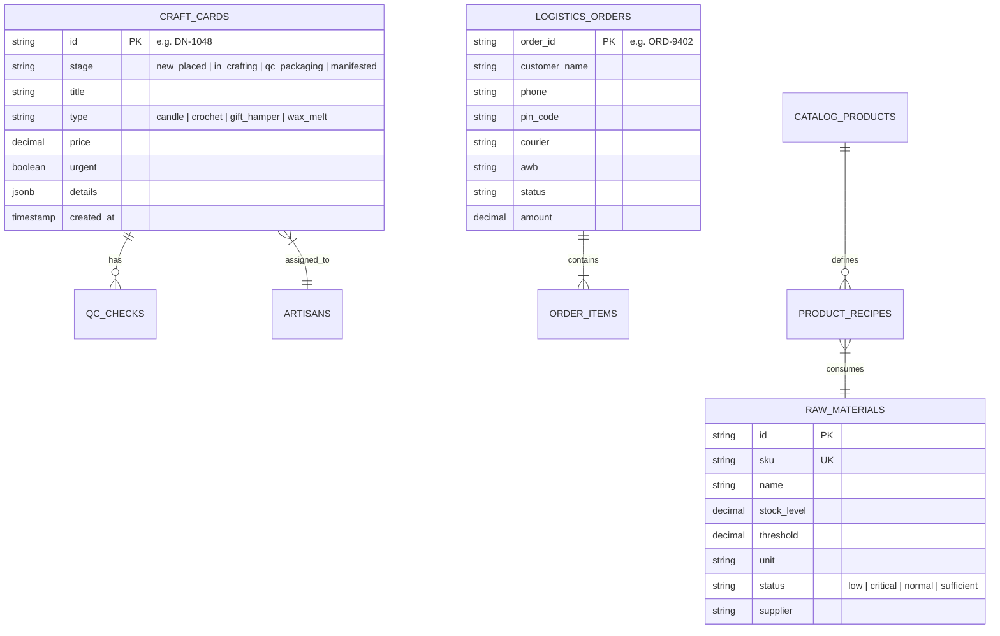

# Project Memory Bank & Living Knowledge Base
**Project:** DashNit Artisan Studio & Operations  
**Entity:** DashNit Crochet & Candle (Jaipur Craft House Unit 02)  
**Last Updated:** 2026-09-08  
**Status:** Production-Ready Persistent Memory  

---

## 1. Project Overview

**DashNit Artisan Studio & Operations** is a dedicated enterprise operations management suite built for high-touch, artisanal production workshops specializing in:
1. **Hand-Poured Botanical Soy Candles & Wax Melts:** Featuring crackling wood wicks, amber/matte glass vessels, custom vinyl inscriptions, and strictly enforced 48-hour fragrance curing cycles.
2. **Handcrafted Crochet Commissions:** Bespoke organic cotton totes, waffle throws, and amigurumi pieces tracked by stitch row progress, custom yarn palettes, and personalized monograms.

The studio operates from **Jaipur Craft House Unit 02**, managing custom client commissions, inventory raw materials, physical atelier floor queues, thermal shipping label generation, and pan-India logistics.

---

## 2. Technology Stack

### Frontend Core
- **Framework & Runtime:** React 19 (`react@19.0.1`, `react-dom@19.0.1`)
- **Build System:** Vite 6 (`vite@6.2.3`) with `@vitejs/plugin-react@5.0.4`
- **Language:** TypeScript 5.8 (`typescript@~5.8.2`) with strict mode enabled
- **Styling & Design System:** Tailwind CSS v4 (`@tailwindcss/vite@4.1.14`, `tailwindcss@4.1.14`)
- **Iconography:** Lucide React (`lucide-react@0.546.0`)
- **Animations:** Motion (`motion@12.23.24`)

### Backend & AI Integrations
- **AI Engine:** Google Gemini API via official SDK (`@google/genai@2.4.0`)
- **Backend Runtime:** Node.js with Express (`express@4.21.2`), `tsx@4.21.0`
- **Configuration & Secrets:** `dotenv@17.2.3`
- **Platform Capability:** Declared `MAJOR_CAPABILITY_SERVER_SIDE_GEMINI_API` in [`metadata.json`](file:///c:/Users/ASUS/DashNit-Studio/metadata.json)

---

## 3. Completed Features & Subsystems

```
┌─────────────────────────────────────────────────────────────────────────┐
│                        DASHNIT STUDIO NAVIGATION                        │
├───────────────┬──────────────────────┬──────────────────────────────────┤
│ Tab Slug      │ Display Title        │ Key Capabilities                 │
├───────────────┼──────────────────────┼──────────────────────────────────┤
│ crafting-queue│ Artisan Crafting     │ 4-Stage Kanban, Curing Timers,   │
│               │ Board                │ Stitch Rows, Batch Sheets        │
├───────────────┼──────────────────────┼──────────────────────────────────┤
│ catalog-and-  │ Catalog & Inventory  │ Dual-Track Ledgers, Batch Pours, │
│ inventory     │ Supervisor           │ WhatsApp Reorders, Stock Audits  │
├───────────────┼──────────────────────┼──────────────────────────────────┤
│ orders-and-   │ Orders & Logistics   │ Courier Manifests, AWB Labels,   │
│ logistics     │ Hub                  │ 4x6 Thermal Prints, Pin Routing  │
├───────────────┼──────────────────────┼──────────────────────────────────┤
│ analytics-and-│ Analytics & Revenue  │ Revenue KPIs, SLA Rates, Margins │
│ revenue       │ Dashboard            │ Category Breakdown, Monthly View │
├───────────────┼──────────────────────┼──────────────────────────────────┤
│ custom-studio │ Custom Order Studio  │ Live Commission Builder, Dynamic │
│               │ (Client Intake)      │ Pricing, Instant Queue Push      │
├───────────────┼──────────────────────┼──────────────────────────────────┤
│ architecture  │ Architecture &       │ Subsystem Inspector, Latency,    │
│               │ Topology Blueprint   │ Endpoints, Topology Diagrams     │
└───────────────┴──────────────────────┴──────────────────────────────────┘
```

### 3.1 Artisan Crafting Board (`CraftingBoard.tsx`)
- **4-Stage Kanban Workflow:**
  - `new_placed`: Captured and paid commissions pending crafter allocation.
  - `in_crafting`: Active production tracking (shows ambient temperature and curing countdown for candles; stitch progress percentages and row counts for crochet).
  - `qc_packaging`: Four-point quality check (wick centering, monogram accuracy, weight check, wax seals).
  - `manifested`: Completed, boxed, and awaiting courier pickup.
- **Dynamic Filters:** All Crafts, Crochet Only, Soy Candles, and Urgent (< 48h SLA) filters.
- **Floor Operations Tools:**
  - `DailyBatchSheetModal`: Printable studio run-sheet summarizing all active lot numbers and crafter assignments.
  - `InspectCardModal`: Full modal inspection of customer details, fragrance notes, gift inscriptions, and QC checklists.
  - Quick stage advancement buttons directly on each Kanban card.

### 3.2 Dual-Track Catalog & Inventory Supervisor (`CatalogInventory.tsx`)
- **Finished Goods Catalog:** Tracks SKUs, craft medium (Soy Wax, Spun Cotton), fulfillment modes (`ready_to_ship`, `made_to_order`, `hybrid`), MRP, GST rates, and reserve buffers.
- **Raw Materials Batch Ledger:** Tracks soy wax flakes, crackling wood wicks, fragrance oils, and organic cotton yarns with real-time stock levels, threshold limits, and batch lot numbers.
- **Automated Supplier Reorders:** One-click WhatsApp PO generation to supplier mills (e.g., Gujarat Organic Wax Refinery, Surat Yarn Mills) with quantity calculation.
- **Batch Pour Trigger:** One-click action to inject +12 finished units to inventory and decrement raw ingredients.

### 3.3 Orders & Logistics Hub (`OrdersLogistics.tsx`)
- **Courier Integration:** Delhivery Surface/Express and BlueDart Apex Air tracking.
- **Dispatch Lifecycle:** `in_crafting` → `ready_for_packing` → `manifested` → `in_transit` → `delivered`.
- **4x6 Thermal Shipping Labels:** Standard thermal print modal featuring QR verification, consignee address, barcode AWB, GST breakdown, and fragile routing tags.
- **Personalized Gift Slips:** Formats custom customer gift notes into printed calligraphy-style slips.

### 3.4 Custom Order Studio (`CustomOrderStudio.tsx`)
- **Interactive Commission Configurator:** Supports custom soy candles (vessel, fragrance, wick style, vinyl inscription) and custom crochet (item type, dual yarn palette picker, monogram).
- **Real-Time Price Calculation:** Dynamically computes vessel base price + wick upgrade + luxury gift box packaging.
- **Direct Queue Ingestion:** Automatically transforms form input into a typed `CraftCard` and prepends it to the live Kanban board with instant toast feedback.

### 3.5 Analytics & Financial Dashboard (`AnalyticsRevenue.tsx`)
- **Operational Metrics:** Daily Studio Capacity (45 units/day), On-Time SLA Fulfillment (96%), Gross Revenue, Average Order Value (AOV).
- **Revenue Distribution:** Breakdown across Soy Candles (48%), Custom Crochet (37%), Wax Melts & Hampers (15%).
- **Margin Analysis:** Tracks gross profit margin (~68% for candles, ~54% for labor-intensive crochet).

### 3.6 Architecture & Blueprint Inspector (`ArchitectureView.tsx`)
- **System Topologies:** Visualizes the 5 architectural tiers (Client Layer, Edge/Security, Core Microservices, Data/Persistence, Async Message Queues).
- **Interactive Inspector:** Clickable subsystems displaying health status, latency, tech stack, and API contracts.

### 3.7 Gemini AI Artisan Concierge (`AIConciergeModal.tsx` & `server.ts`)
- **Natural Language Parsing:** Consumes raw customer WhatsApp inquiries, Instagram direct messages, or voice note transcripts.
- **Server-Side Microservice:** Powered by `@google/genai` with `gemini-2.5-flash` (`POST /api/v1/ai/parse-commission`), with client-side fallback heuristic parser for zero-downtime execution.
- **Formulation Intelligence:** Suggests scent pairings, wick pairings (e.g. crackling rosewood), and yarn palettes, auto-detecting urgent deadlines (< 48h).
- **One-Click Queue Dispatch:** Direct creation of typed `CraftCard` objects queued into the live Jaipur Crafting Board.

### 3.8 Session State Persistence Engine (`src/utils/storage.ts`)
- **Local Synchronization:** Automatically mirrors `craftCards`, `catalogProducts`, `rawMaterials`, and `logisticsOrders` to browser `localStorage`.
- **Fault-Tolerant Reloads:** Moving cards between stages, batch pours, purchase orders, or newly registered commissions persist across hard browser reloads.

### 3.9 Role-Based Access Control (RBAC) System
- **Operational Personas:**
  - `atelier_manager`: Atelier Director (Full operational & approval authority).
  - `artisan_crafter`: Floor Artisan (Craft queue, curing countdowns, stitch progress).
  - `qc_packaging`: Quality Assurance Specialist (QC checklists, wax seal inspection, gift note printing).
  - `logistics_dispatcher`: Logistics Lead (Courier manifests, 4x6 thermal labels, AWB tracking).
- **Header Switcher:** Interactive dropdown in `Header.tsx` allowing instant persona simulation on the workshop floor.

### 3.10 Atelier Barcode & QR Scanner Workbench (`ScannerWorkbenchModal.tsx` & `scannerListener.ts`)
- **Keystroke Stream Hook:** Global event listener detecting laser/CCD scanner burst inputs (< 50ms keystrokes).
- **Fast-Advance Action Barcodes:** Supports hands-free stage progression (`ACTION:STAGE_IN_CRAFTING`, `ACTION:STAGE_QC`, `ACTION:STAGE_MANIFEST`).
- **Dispatch Bin Allocator:** Routes completed boxed orders to physical staging lockers (`BIN-JA-01` through `BIN-JA-08`).

### 3.11 IoT Curing Room Environmental Telemetry (`IoTCuringTelemetry.tsx`)
- **Micro-Climate Monitoring:** Tracks real-time temperature (22°C–25°C threshold), humidity (40%–50% RH), and VOC index.
- **Thermal Safety Lock:** Automated sensor protection pausing 48-hour cure timers if ambient temperatures exceed 25°C to avoid fragrance sweating.
- **Simulation Suite:** Allows workshop supervisors to test environmental anomalies on demand.

### 3.12 Gemini Vision Automated QC Surface Auditor (`GeminiVisionQCModal.tsx`)
- **Photographic Inspection:** Analyzes camera snapshots of finished soy candles and crochet goods using Gemini 2.5 Flash Vision.
- **Defect Detection:** Evaluates wick plumb centering, candle surface cavity sinkholes, monogram embroidery tension, and wax seal fidelity.
- **Automated Certification:** One-click pass button generating verified QC badges and populating physical inspection checklists.

### 3.13 Direct Thermal ZPL Printing Engine (`Modals.tsx`)
- **Native Thermal Code:** Generates 203/300 DPI Zebra Programming Language (`^XA ... ^XZ`) payloads directly from order shipping records.
- **Hardware Agnostic:** Formats 4x6 inch thermal labels for direct wireless spooling to TSC, Zebra, and Citizen industrial label printers.

### 3.14 Multi-Hub Atelier Network & Switcher (`Header.tsx` & `types.ts`)
- **Multi-Workshop Federation:** Manages operational routing across 3 primary atelier nodes:
  - `jaipur_02`: Main Atelier (Hand-Poured Soy Candles & Bespoke Laser Vector Inscriptions).
  - `jaipur_01`: Heritage Loom (Handcrafted Cotton Crochet Coasters, Waffle Throws, Monograms).
  - `mumbai_hub`: 3PL Distribution & Cold Storage (Fast Metro Fulfillment, Bulk Corporate Warehousing).
- **Interactive Switcher:** Real-time hub switcher in `Header.tsx` with active capacity load indicator (e.g. 78% capacity), focus tags, and automated localStorage persistence (`current_hub`).

### 3.15 Public Customer Live Tracking Portal (`CustomerTrackingPortalModal.tsx`)
- **Self-Service Guest Access:** Simulates public storefront tracking portal (`track.dashnit.com`) without requiring atelier staff login.
- **Milestone Stepper:** 4-stage visual timeline matching the physical craft lifecycle (`new_placed` → `in_crafting` → `qc_packaging` → `manifested`).
- **48-Hour Curing Dial:** Dynamic visual gauge showing percentage cured, remaining cure time, and vault ambient temperature.
- **Artisan Heritage Spotlight:** Displays the assigned craftsperson's bio, years of heritage, and preview of personalized wax-sealed gift notes.
- **Live Courier Sync:** Direct Delhivery Surface and BlueDart Apex Air tracking with live courier milestone timestamps.

### 3.16 B2B Bulk Corporate Gifting Engine (`CorporateGiftingModal.tsx`)
- **Enterprise Gift Suites:** Curated executive hampers including *The Royal Jaipur Executive Suite* (₹1,299), *The Organic Artisan Duet* (₹1,699), and *Botanical Wax Discovery Vault* (₹899).
- **Tiered Volume Discount Calculator:**
  - 25–49 units: 5% volume discount (Bronze Tier).
  - 50–199 units: 12% volume discount (Silver Tier).
  - 200+ units: 20% volume discount + complimentary custom brass branding die (Gold Tier).
- **Branded Laser Engraving Simulation:** Real-time wood lid preview featuring custom client corporate logos and bespoke celebration inscriptions.
- **Multi-City Dropship Allocation:** Simulates proportional distribution across Bangalore, Mumbai, Delhi-NCR, and Hyderabad corporate campuses.
- **1-Click Batch Queuing:** Immediately injects batch commissions with `CORP-` identifier prefix directly into the active crafting queue.

### 3.17 Artisan Piece-Rate Wage & Payroll Ledger (`ArtisanWageLedgerModal.tsx`)
- **Transparent Piece-Rate Accounting:** Itemized labor compensation records for workshop artisans:
  - Botanical candle pours (₹120/unit).
  - Custom vector engravings (₹85/unit).
  - Cotton crochet coasters (₹140/set).
  - Waffle throws (₹450/piece).
  - Floor coordination & curing audits (₹4,500 base).
- **Zero-Defect Quality Incentive:** Automatically applies a +10% bonus for artisans achieving >98% QC pass rates audited by Gemini Vision.
- **Instant UPI Disbursement:** 1-Click instant payout simulation with bank transaction verification.
- **Printable Payroll Vouchers:** Standardized offline accounting vouchers with official atelier stamp.

---

## 4. Pending Features & Technical Backlog

| Feature | Target Subsystem | Priority | Complexity | Description |
| :--- | :--- | :--- | :--- | :--- |
| **PostgreSQL Database Migration** | Persistence Layer | High | High | Replace in-memory/localStorage bridge with Prisma ORM and production Postgres DB. |
| **Redis Curing Queue Workers** | Background Workers | High | Medium | Offload 48-hour chemical curing countdowns to distributed Redis sorted sets. |
| **Live WhatsApp Cloud API Webhook** | Backend Services | High | Medium | Direct two-way customer messaging via Meta WhatsApp Business Cloud API. |

---

## 5. API Endpoints Specification

When transitioning from the current reactive in-memory layer to full backend services, endpoints must conform to the following contracts:

### 5.1 AI Concierge & Commission Parsing
```http
POST /api/v1/ai/parse-commission
Content-Type: application/json

Request Body:
{
  "message": "Hi! Ananya here (+91 98765 43210). Need an urgent soy candle in amber glass for Maya's 25th birthday with lavender and cedarwood. Inscribe 'Happy 25th Maya!'"
}

Response (200 OK):
{
  "success": true,
  "source": "gemini_2_5_flash",
  "data": {
    "customerName": "Ananya Sharma",
    "customerPhone": "+91 98765 43210",
    "craftType": "candle",
    "title": "Bespoke Soy Candle (French Lavender)",
    "subtitle": "Scent: French Lavender & Cedarwood • Amber Glass Jar",
    "scentProfile": "French Lavender & Cedarwood",
    "vinylInscription": "“Happy 25th Maya!”",
    "price": 849,
    "urgent": true,
    "leadTimeDays": 2,
    "confidenceScore": 0.98,
    "aiHarmonyRecommendation": "Formulation: 8.5% Botanical fragrance load in Pure Soy 464 with Rosewood Wick."
  }
}
```

### 5.2 Commissions & Craft Queue
```http
POST /api/v1/commissions/intake
Content-Type: application/json

Request Body:
{
  "craftType": "candle" | "crochet",
  "customerName": "Ananya Sharma",
  "customerPhone": "+919876543210",
  "details": {
    "scent": "French Lavender & Cedar",
    "wick": "Crackling Rosewood",
    "vinylInscription": "Happy 25th Maya!"
  },
  "giftNote": "Wishing you joy!"
}

Response (201 Created):
{
  "id": "DN-1055",
  "stage": "new_placed",
  "estimatedReadyDate": "2026-09-12T10:00:00Z",
  "price": 849
}
```

```http
PATCH /api/v1/commissions/:id/advance-stage
Content-Type: application/json

Request Body:
{
  "newStage": "in_crafting" | "qc_packaging" | "manifested",
  "qcNotes": ["Wick centered", "Surface smooth", "Label aligned"],
  "artisanId": "ART-04"
}
```

### 5.2 Inventory & Procurement
```http
GET /api/v1/inventory/raw-materials
Response (200 OK):
[
  {
    "id": "raw-01",
    "sku": "RAW-SOY-WAX",
    "stockLevel": 12.5,
    "unit": "kg",
    "threshold": 15.0,
    "status": "low"
  }
]
```

```http
POST /api/v1/inventory/raw-materials/:id/purchase-order
Request Body:
{
  "supplier": "Gujarat Organic Wax Refinery",
  "quantity": "50 kg",
  "channel": "whatsapp_automated"
}
```

### 5.3 Logistics & Courier Integration
```http
POST /api/v1/logistics/orders/:orderId/manifest
Request Body:
{
  "courier": "Delhivery Express",
  "weightGrams": 450,
  "dimensions": { "length": 15, "width": 15, "height": 12 }
}

Response (200 OK):
{
  "awb": "DEL-994821039",
  "labelUrl": "https://cdn.dashnit.com/labels/DEL-994821039.pdf",
  "pickupDate": "2026-09-09T14:00:00Z"
}
```

---

## 6. Database Schema Summary (PostgreSQL)



### Table Definitions
1. **`craft_cards`:** Primary queue entity for workshop orders. Stores stage, assigned artisan ID, curing timestamps, and JSONB payload for custom configurations (scent, wick, monogram).
2. **`catalog_products`:** Finished product master data. Includes SKU, category, fulfillment mode, MRP, GST rate, and physical stock count.
3. **`raw_materials`:** Atelier raw ingredient stock ledger. Tracks batch lot numbers, threshold levels, units of measurement (kg, meters, pieces), and standard reorder quantities.
4. **`logistics_orders`:** Dispatch table holding shipping addresses, courier partner names, AWB tracking codes, and delivery status milestones.
5. **`artisan_profiles`:** Craftsmen in Jaipur Unit 02 (e.g., Dashrath M., Leela D., Kavita S.) with assigned specialties and active queue loads.

---

## 7. Important Business Logic & Operational Formulas

### 7.1 Candle Curing State Lock
- Soy wax candles require a minimum of **48 hours (2,880 minutes)** curing time before being placed into courier transit.
- Room temperature must be maintained between **22°C and 25°C** to avoid surface frosting or fragrance oil sweating.
- Formula for curing progress percentage:
  $$\text{Cure } \% = \min\left(100, \frac{\text{Current Time} - \text{Pour Time}}{48 \text{ hours}} \times 100\right)$$
- An order cannot transition to `qc_packaging` until $\text{Cure } \% = 100\%$.

### 7.2 Dynamic Custom Order Pricing Model
$$\text{Total Price} = \text{Base Price} + \text{Wick Add-on} + \text{Packaging Surcharge}$$
- **Candle Base:** ₹799 (Amber Jar, 220g)
- **Wood Wick Upgrade:** +₹50
- **Crochet Base:** ₹1,499 (Daisy Tote Bag) / ₹3,200 (Waffle Throw)
- **Luxury Presentation Box:** +₹150 (Includes debossed wax seal and seed-paper gift card)

### 7.3 Raw Material Replenishment Trigger
$$\text{Low Stock Alert Triggered} \iff \text{Current Stock Level} \le \text{Threshold}$$

### 7.4 B2B Corporate Gifting Volume Discount Model
$$\text{Discount Rate } D(Q) = \begin{cases} 
0\% & \text{if } Q < 25 \\
5\% & \text{if } 25 \le Q < 50 \quad (\text{Bronze Tier}) \\
12\% & \text{if } 50 \le Q < 200 \quad (\text{Silver Tier}) \\
20\% & \text{if } Q \ge 200 \quad (\text{Gold Tier + Complimentary Brass Die})
\end{cases}$$

$$\text{Net Order Amount} = (Q \times \text{Base Price}) \times (1 - D(Q))$$

### 7.5 Artisan Piece-Rate Wage & Zero-Defect Quality Bonus
$$\text{Base Piece Earnings} = \sum_{i=1}^{n} (\text{Completed Units}_i \times \text{Task Rate}_i)$$

$$\text{Zero-Defect Quality Bonus} = \begin{cases} 
\text{Base Piece Earnings} \times 10\% & \text{if } \text{QC Pass Rate} \ge 98.0\% \\
0 & \text{otherwise}
\end{cases}$$

$$\text{Gross Disbursed Payout} = \text{Base Piece Earnings} + \text{Zero-Defect Quality Bonus}$$

- When triggered, UI highlights item in **Crimson Clay** (`#ba1a1a`).
- Clicking **"Reorder via WhatsApp"** opens pre-drafted WhatsApp message to the registered mill supplier.

---

## 8. Known Issues & Operational Nuances

1. **In-Memory State Lifespan:** Because state resides in React memory (`useState` in `App.tsx`), hard refreshing the browser window resets newly added commissions or batch pours to the baseline mock dataset. (Resolved once backend persistence is connected).
2. **Thermal Label Print Margins:** On certain desktop browsers, the print preview for 4x6 labels may default to A4 paper. Users must select "4x6 inch / 100x150mm" in the native print dialog.
3. **Kanban Horizontal Scroll:** On smaller laptop screens (under 1200px width), the Kanban viewport requires horizontal scrolling (`min-w-[1150px]`) to maintain 4 legible columns without card squishing.

---

## 9. Future Roadmap

### Phase 1: Atelier Core Operations (Completed - Q3 2026)
- [x] 4-Stage Kanban crafting queue with live cards
- [x] Dual-track catalog & raw material supervisor
- [x] Thermal shipping label generator & courier manifest preview
- [x] Custom Order Commission Studio with dynamic pricing
- [x] System Architecture & Topology visualizer

### Phase 2: Automation & Persistence (Q4 2026)
- [ ] Connect PostgreSQL database via Prisma ORM
- [ ] Server-side Gemini AI concierge for natural language WhatsApp message ingestion
- [ ] WhatsApp Cloud API webhook receiver for instant commission status updates
- [ ] Barcode scanning support for atelier tablet cameras

### Phase 3: Enterprise Expansion (Q1–Q2 2027)
- [ ] Multi-workshop synchronization (Jaipur Unit 01 + Jaipur Unit 02)
- [ ] Automated Gemini Vision quality control inspection
- [ ] Direct API integrations with Delhivery and BlueDart shipping portals
