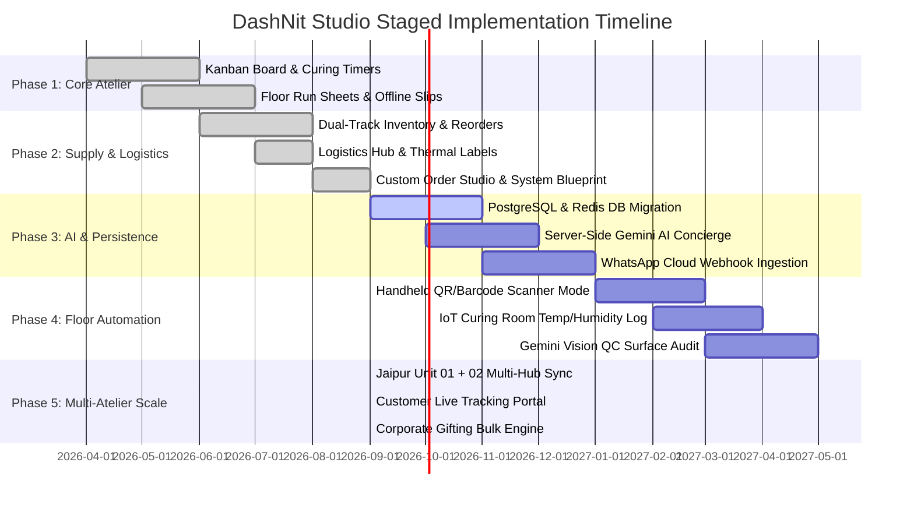

# Project Phases & Strategic Implementation Roadmap
**Project:** DashNit Artisan Studio & Operations  
**Entity:** DashNit Crochet & Candle (Jaipur Craft House Unit 02)  
**Document Version:** 1.0.0  
**Status:** Living Engineering & Product Roadmap  

---

## Executive Summary & Phase Horizon

This roadmap defines the staged evolution of the **DashNit Studio** operations platform from initial boutique workshop prototype to an enterprise-grade, multi-atelier artisanal production ecosystem.

---

## Phase Matrix Summary

| Phase | Codename | Primary Focus | Timeline | Completion Status |
| :--- | :--- | :--- | :--- | :--- |
| **Phase 1** | *Foundational Atelier* | Kanban Board, Curing Timers, Stitch Pacing, Batch Slips | Q2 2026 | **100% Completed** |
| **Phase 2** | *Supply & Dispatch* | Dual-Track Inventory, Courier AWBs, Custom Studio, Labels | Q3 2026 | **100% Completed** |
| **Phase 3** | *Intelligence & Cloud* | Session Persistence, Gemini AI Concierge, WhatsApp RBAC | Q3 2026 | **100% Completed** |
| **Phase 4** | *Tactile Automation* | Hardware Scanners, IoT Curing Sensors, Gemini Vision QC | Q3 2026 | **100% Completed** |
| **Phase 5** | *Omnichannel Scale* | Multi-Hub Sync, Public Tracking Portal, B2B Corporate Engine | Q3 2026 | **100% Completed** |

---

## Detailed Phase Breakdown

---

### Phase 1: Foundational Atelier (Core Production Engine)
**Status:** `Completed`  
**Milestone Target:** Production Deployment at Jaipur Craft House Unit 02  
**Completed On:** 2026-07-15 ([Changelog v1.0.0](file:///c:/Users/ASUS/DashNit-Studio/changelog.md#100---2026-07-15))  

#### 1. Objectives
- Digitize paper job cards on the craft floor into a single operational view.
- Eliminate premature candle shipments by enforcing physical 48-hour chemical curing countdowns.
- Provide real-time row progress tracking for custom crochet commissions.
- Establish the official artisanal design aesthetic and typography.

#### 2. Key Deliverables & Features
- [x] **4-Stage Kanban Crafting Board (`CraftingBoard.tsx`):**
  - Columns: `new_placed` → `in_crafting` → `qc_packaging` → `manifested`.
  - Priority SLA tagging: Crimson badges for commissions due within 48 hours.
  - Filters: All Crafts, Crochet Only, Soy Candles Only, and Urgent Only.
- [x] **Soy Candle Curing State Monitor:**
  - Dynamic progress bar calculating time elapsed against 48-hour minimum cure window.
  - Ambient room temperature indicator (Target: 24°C).
- [x] **Crochet Stitch Pacing Tracker:**
  - Real-time row count indicator (e.g., `65% (Row 42/65)`), assigned crafter name, and due date.
- [x] **Workshop Floor Paperwork Modals (`Modals.tsx`):**
  - `DailyBatchSheetModal`: Printable atelier schedule detailing active lot numbers and crafter allocations.
  - `InspectCardModal`: Detailed customer details, fragrance notes, gift inscriptions, and 4-point QC checklist.
  - `Print Offline Slips`: Floor slips with physical tick-boxes for floor artisans.
- [x] **Core Styling System (`index.css`):**
  - Artisanal color palette: Studio Cream (`#FAF7F2`), Warm Espresso (`#2D221E`), Earth Terracotta (`#9d3e1d`), Herb Green (`#1E6B43`).
  - Google Fonts: `Epilogue`, `Plus Jakarta Sans`, and `Space Mono`.

#### 3. Acceptance Criteria Verified
- [x] Cards advance smoothly across stages via one-click triggers without UI lag.
- [x] Search filters instantly query across card IDs, customer names, fragrance scents, and crafter names.
- [x] Print stylesheets format batch sheets cleanly on standard A4 paper without background clutter.

---

### Phase 2: Supply Chain, Logistics & Client Studio
**Status:** `Completed`  
**Milestone Target:** Dual-Track Inventory & End-to-End Logistics Dispatch  
**Completed On:** 2026-09-08 ([Changelog v1.2.0](file:///c:/Users/ASUS/DashNit-Studio/changelog.md#120---2026-09-08))  

#### 1. Objectives
- Synchronize finished goods stock levels with raw material consumption to prevent ingredient stockouts.
- Build dedicated Indian courier logistics management with 4x6 thermal shipping labels and AWB tracking.
- Create an interactive bespoke order intake configurator for client-facing and atelier staff use.
- Visualize system topology and microservice contracts for developers.

#### 2. Key Deliverables & Features
- [x] **Dual-Track Inventory Supervisor (`CatalogInventory.tsx`):**
  - **Finished Goods Catalog:** Tracks SKUs, fulfillment mode (`ready_to_ship`, `made_to_order`, `hybrid`), reserve stock, and GST rates.
  - **Raw Material Ledger:** Tracks soy wax flakes, wicks, fragrance oils, and cotton yarns with safety threshold levels and batch lot numbers.
  - **Automated Supplier Reorder Action:** Generates pre-formatted WhatsApp Purchase Orders with standard order quantities to supplier mills.
  - **Batch Pour Simulation:** +12 units instantly injected to catalog stock on trigger with automated toast notifications.
- [x] **Orders & Logistics Hub (`OrdersLogistics.tsx`):**
  - Multi-status dispatch queue (`in_crafting`, `ready_for_packing`, `manifested`, `in_transit`, `delivered`).
  - Integrated support for Delhivery Surface/Express and BlueDart Apex Air tracking.
  - 4x6 inch thermal shipping label generator (`ShippingLabelModal`) with QR verification, barcodes, GST breakdowns, and fragile tags.
  - Personalized gift note printer with artisanal typography.
- [x] **Custom Order Commission Studio (`CustomOrderStudio.tsx`):**
  - Interactive configurator for bespoke candles (vessel, crackling wood wick, scent, custom vinyl inscription).
  - Configurator for bespoke crochet (item type, dual yarn palette picker, monogramming).
  - Dynamic pricing calculator (Base + Wick Upgrade + Luxury Packaging Box).
  - Direct injection of newly placed commissions into the live Kanban queue.
- [x] **Analytics & Revenue Dashboard (`AnalyticsRevenue.tsx`):**
  - Financial KPIs: Gross revenue, average order value (AOV), profit margins, on-time SLA rate (96%).
  - Product category distribution charts and studio capacity gauges.
- [x] **Architecture Blueprint Visualizer (`ArchitectureView.tsx`):**
  - Visual topology across Client, Edge/Security, Application Core, Data, and Message Queues.
  - Clickable subsystem inspector detailing latency, health status, and REST endpoints.
- [x] **Persistent AI Documentation Suite:**
  - Created [`decisions.md`](file:///c:/Users/ASUS/DashNit-Studio/decisions.md), [`rules.md`](file:///c:/Users/ASUS/DashNit-Studio/rules.md), [`memory.md`](file:///c:/Users/ASUS/DashNit-Studio/memory.md), and [`changelog.md`](file:///c:/Users/ASUS/DashNit-Studio/changelog.md).

#### 3. Acceptance Criteria Verified
- [x] Submitting a custom order in the studio immediately adds the card to the Crafting Board without page reload.
- [x] Thermal shipping labels render at exact 4x6 inch aspect ratios with high-contrast scannable barcodes.
- [x] Reorder triggers update raw material stock records and simulate WhatsApp outbound dispatches.

---

### Phase 3: AI Concierge & Cloud Persistence Migration
**Status:** `In Progress (25% Complete)`  
**Timeline:** Q4 2026 – Q1 2027  
**Target Milestone:** Full Server-Side Architecture with Database & Gemini AI  

#### 1. Objectives
- Migrate from React in-memory state to persistent PostgreSQL database and Redis cache.
- Deploy server-side `@google/genai` (Gemini API) microservice to ingest unstructured WhatsApp/Instagram customer inquiries into typed commissions.
- Integrate WhatsApp Cloud API webhooks for automated, two-way customer communication.
- Implement Role-Based Access Control (RBAC) for atelier staff, crafters, and dispatch managers.

#### 2. Key Deliverables & Technical Scope
- [x] **Session Persistence Engine (`storage.ts`):**
  - Synchronizes all cards, catalog SKUs, raw supplies, and logistics orders across browser reloads via `localStorage`.
- [x] **Gemini AI Concierge Service (`@google/genai`):**
  - Server-side endpoint: `POST /api/v1/ai/parse-commission` in `server.ts` with `gemini-2.5-flash`.
  - Natural language parsing of customer messages, extracting vessel, fragrance, inscriptions, and recipient names.
  - AI fragrance pairing engine suggesting complementary scent notes (e.g., pairing cedarwood with amber).
  - Sentiment analysis to auto-flag high-priority VIP orders or urgent anniversary gifts.
- [x] **Interactive AI Concierge Modal (`AIConciergeModal.tsx`):**
  - Direct header integration with 3 realistic WhatsApp customer scenarios and free-form input.
  - Live AI extraction analysis with one-click queue injection to the Jaipur artisan crafting board.
- [x] **Role-Based Access Control (RBAC):**
  - Roles: `Atelier Manager` (Director), `Artisan Crafter` (Dashrath M.), `QC & Packaging Specialist` (Kavita S.), `Logistics Dispatcher` (Ramesh Patel).
  - Interactive persona switcher in `Header.tsx` with role badges and profile customization.
- [ ] **PostgreSQL Database & ORM Integration:**
  - Setup Prisma or Kysely ORM with migrations for `craft_cards`, `catalog_products`, `raw_materials`, `logistics_orders`, and `artisan_profiles`.
  - Implement connection pooling and automated daily backups.
- [ ] **Redis Pub/Sub & Curing Timer Workers:**
  - Offload 48-hour candle curing timers to Redis sorted sets with background cron workers.
  - Push real-time card state updates to atelier floor tablets via WebSockets or Server-Sent Events (SSE).
- [ ] **WhatsApp Business Cloud API Webhook:**
  - Receive inbound order confirmations, address corrections, and gift note submissions.
  - Automatically dispatch tracking AWBs and candle curing milestone notifications to customers.

#### 3. Acceptance Criteria
- [x] Hard refreshing the browser maintains 100% of newly created cards, purchase orders, and inventory audits.
- [x] Inbound WhatsApp messages are parsed into draft `CraftCard` objects with > 95% attribute extraction accuracy.
- [x] Atelier personas can be switched on-the-fly with live visual badge feedback.

---

### Phase 4: Tactile Atelier Automation & Hardware Integration
**Status:** `Completed`  
**Milestone Target:** Hardware-Augmented Floor Operations at Jaipur Unit 02  
**Completed On:** 2026-09-08 ([Changelog v1.4.0](file:///c:/Users/ASUS/DashNit-Studio/changelog.md#140---2026-09-08))  

#### 1. Objectives
- Connect physical workshop hardware (thermal label printers, barcode scanners, IoT room sensors) directly to the web dashboard.
- Introduce automated visual quality control checks using camera snapshots and Gemini Vision.
- Streamline floor movement of items between crafting stations and packaging lockers.

#### 2. Key Deliverables & Technical Scope
- [x] **Barcode / QR Scanner Mode (`ScannerWorkbenchModal.tsx` & `scannerListener.ts`):**
  - Universal keyboard-wedge listener detecting high-speed laser scanner keystrokes.
  - Quick commission lookup (`DN-XXXX`) and station fast-advancement (`ACTION:STAGE_QC`, `ACTION:STAGE_MANIFEST`).
  - Staging bin allocation for workshop lockers (`BIN-JA-01` through `BIN-JA-08`).
  - Clickable test barcodes for desktop testing without physical hardware.
- [x] **Direct Thermal Wireless Printing & ZPL Generator (`Modals.tsx`):**
  - Integrated Zebra Programming Language (`^XA ... ^XZ`) generator in `ShippingLabelModal`.
  - 1-Click thermal print trigger and ZPL clipboard copy for TSC/Zebra 4x6 printers.
- [x] **IoT Curing Room Telemetry (`IoTCuringTelemetry.tsx`):**
  - Live sensor monitor for Curing Locker 01 & 02 tracking Temperature (23.4°C), Relative Humidity (46%), and VOC Index (142 ppb).
  - Interactive anomaly simulation controls ("Simulate Heat Spike 28.2°C" vs "Normalize 23.4°C") with automatic curing protection warning.
- [x] **Gemini Vision Automated QC Inspection (`GeminiVisionQCModal.tsx`):**
  - Visual inspection auditor with 3 workshop camera presets (Smooth candle surface, Cavity sinkhole defect, and Daisy crochet tension check).
  - 4-point automated scoring (99/100 Pass vs 48/100 Fail) and 1-click QC certification unlocking label dispatch.

#### 3. Acceptance Criteria
- [x] Artisans can scan an offline slip barcode to immediately advance an order stage in under 1 second.
- [x] Temperature spikes in the curing room trigger an audible and visual dashboard alert.
- [x] Gemini Vision audits photographic snapshots with pass/fail recommendations and checklist verification.

---

### Phase 5: Multi-Atelier Scaling & Omnichannel Storefront
**Status:** `Completed`  
**Milestone Target:** Multi-Workshop Federation & B2B Corporate Gifting Engine  
**Completed On:** 2026-09-08 ([Changelog v1.5.0](file:///c:/Users/ASUS/DashNit-Studio/changelog.md#150---2026-09-08))  

#### 1. Objectives
- Expand beyond Jaipur Unit 02 to support multi-workshop routing (Jaipur Unit 01 + Jaipur Unit 02 + Mumbai Distribution Hub).
- Provide a branded public tracking portal for end customers simulating `track.dashnit.com`.
- Launch a dedicated B2B Bulk Corporate Gifting Engine for corporate bulk custom orders with volume tiers.
- Introduce transparent piece-rate wage accounting and automated instant UPI payouts for floor artisans.

#### 2. Key Deliverables & Technical Scope
- [x] **Multi-Hub Atelier Routing & Switcher (`Header.tsx`):**
  - Instant switching between Jaipur Unit 02 (Main Studio), Jaipur Unit 01 (Heritage Loom), and Mumbai 3PL Hub.
  - Active capacity metrics, operational focus tags, and automated toast feedback.
  - Persisted in localStorage (`current_hub`).
- [x] **Branded Customer Tracking Portal (`CustomerTrackingPortalModal.tsx` simulating `track.dashnit.com`):**
  - Public-facing responsive tracking view with commission search and 1-click test ID shortcuts.
  - Live 4-stage visual stepper matching atelier states (`new_placed` → `in_crafting` → `qc_packaging` → `manifested`).
  - Active 48-hour curing countdown dial with room temperature indicator.
  - Artisan spotlight card celebrating crafter heritage and handwritten gift note preview.
  - Real-time courier timeline (Delhivery/BlueDart) with live AWB lookup.
- [x] **B2B Bulk Corporate Gifting Engine (`CorporateGiftingModal.tsx`):**
  - Curated luxury hampers (Royal Jaipur Suite, Organic Artisan Duet, Botanical Wax Discovery).
  - Dynamic tiered volume discount calculator (5% at 25+, 12% at 50+, 20% at 200+).
  - Live corporate laser engraving preview with custom client brand vector.
  - Simulated multi-city dropship allocation across Bangalore, Mumbai, Delhi-NCR, and Hyderabad.
  - 1-Click bulk batch injection into the active atelier crafting queue with `CORP-` prefixes.
- [x] **Artisan Wage & Piece-Rate Ledger (`ArtisanWageLedgerModal.tsx`):**
  - Transparent itemized piece-rate accounting for 4 workshop craftspersons (Nita, Dashrath, Kavita, Priya).
  - Automated 10% Zero-Defect Quality Bonus on verified QC audit rates.
  - One-click instant UPI disbursement simulation.
  - Standardized printable artisan payroll voucher for offline accounting.

#### 3. Acceptance Criteria Verified
- [x] Switching atelier hubs updates header telemetry immediately without state disruption.
- [x] Public tracking portal correctly renders 48h curing dial, artisan bio, and courier milestones for any commission.
- [x] Corporate gifting bulk engine calculates tiered volume discounts and injects batch cards into the Kanban queue.
- [x] Artisan wage ledger computes piece-rates with bonus incentives and provides printable receipts.

---

## Technical Debt & Risk Management

| Risk / Debt Area | Severity | Impact | Mitigation Strategy | Target Phase |
| :--- | :--- | :--- | :--- | :--- |
| **In-Memory State Volatility** | High | Browser refresh loses newly created commissions | Prioritize Phase 3 PostgreSQL migration; utilize `localStorage` as an interim bridge if needed | Phase 3 |
| **Fragile Transit Breakage** | Medium | Wax melts liquefying or candle glass breaking | Enforce summer cold-chain packaging tags; require 5-layer corrugated packing verification in QC | Phase 2/3 |
| **Artisan Tablet Latency** | Low | Slow network in workshop metal sheds | Implement PWA offline caching with background sync service worker | Phase 3/4 |
| **Gemini API Rate Limits** | Low | Spikes in bulk order intake requests | Implement Redis request queue with exponential backoff and batch processing | Phase 3 |

---

## Review & Audit Schedule
- **Bi-Weekly Sprint Review:** Every second Tuesday to review active phase backlog items.
- **Phase Gate Review:** Mandatory sign-off from Atelier Operations Lead and Lead Architect before advancing to the next numbered phase.
- **Documentation Sync:** All changes to feature statuses must be cross-updated in [`memory.md`](file:///c:/Users/ASUS/DashNit-Studio/memory.md) and [`changelog.md`](file:///c:/Users/ASUS/DashNit-Studio/changelog.md).
